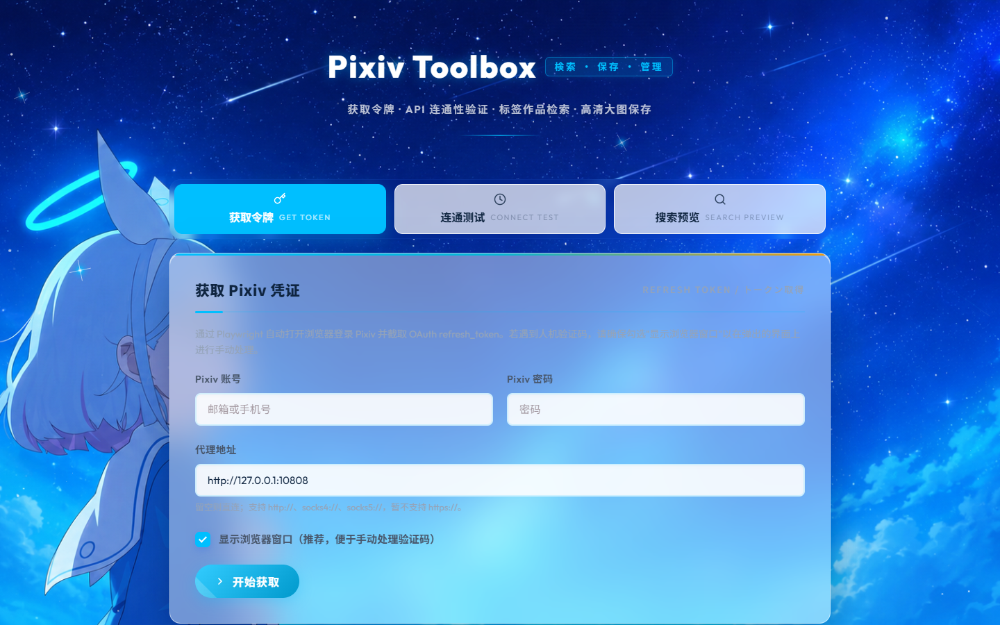
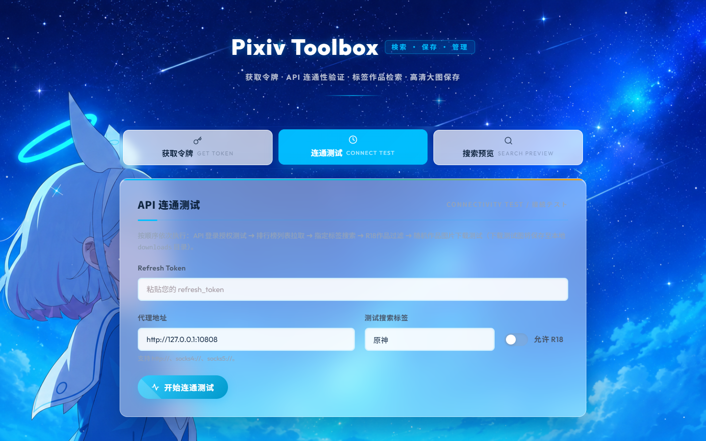
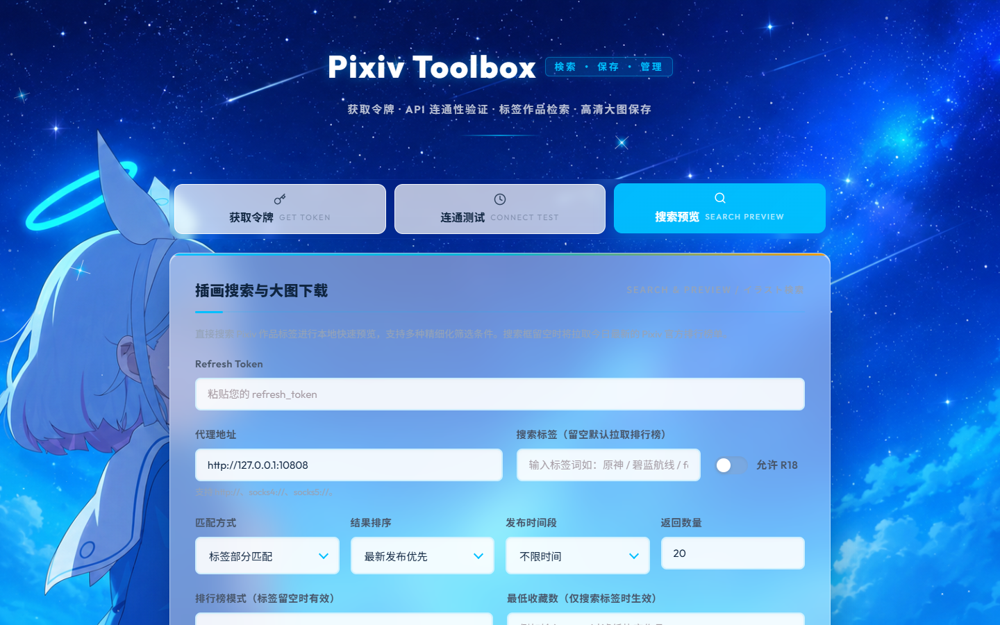

<div align="center">

# Pixiv Toolbox

### 検索 · 保存 · 管理

**一个为二次元爱好者打造的 Pixiv 搜索下载 Web 工具 · 自带蔚蓝档案 (Blue Archive) 风格 UI · 基于 Flask + Playwright + pixivpy-async。**

[](LICENSE)
[](https://www.python.org/)
[](https://flask.palletsprojects.com/)
[](https://playwright.dev/python/)
[](https://github.com/shitianyaa/pixiv-toolbox/stargazers)
[](https://github.com/shitianyaa/pixiv-toolbox/commits)

[English](./README.md) · **简体中文**



</div>

---

**Pixiv Toolbox** 是一个本地运行的 Web GUI 工具，把和 Pixiv 打交道需要的一整套流程都打包在一个浏览器标签页里：浏览器登录获取 OAuth `refresh_token`、API 连通性自检、标签作品检索（含丰富过滤条件）、图卡 / 列表预览、多画质下载。

它面向两类人：

- **二次元 / ACG 爱好者** —— 想要一个"真的好看"的 Pixiv 下载工具，而不是又一个朴素的 Bootstrap 后台。
- **Python 开发者** —— 需要一份基于 `pixivpy-async` 的清爽参考实现来快速搭建自己的 P 站工具链。

#### 为什么用它（相比其他 Pixiv 下载器）

- **颜值在线** —— 默认蔚蓝档案 (Blue Archive) 主题，自带 Arona 立绘背景与蓝青色调，自定义 canvas 动效，告别朴素 UI。
- **一站式工作流** —— 登录、自检、搜索、下载全在一个页面内完成，无需在命令行和脚本间来回复制 token。
- **网络零配置** —— Clash / V2Ray / Shadowsocks 等本地代理端口自动检测，HTTP / SOCKS4 / SOCKS5 通吃。

## ✨ 功能特性

- 🔐 **一键获取 Token** —— 调用 Playwright 自动打开浏览器登录 Pixiv，截取 OAuth `refresh_token`；遇到人机验证码可手动处理。
- 🎌 **二次元主题 UI** —— 默认蔚蓝档案风格，canvas 星空动效、中日双语字体排版。
- 🔍 **强大的标签检索** —— 支持日期范围、排行榜模式、排序方式、最低收藏数、R-18 开关等过滤条件。
- 🖼️ **图卡 / 列表双预览** —— 一键切换图卡瀑布流与结构化列表视图。
- 📥 **多画质下载** —— 原图 / 大图 / 中图自由选择，默认保存到 `downloads/` 目录。
- 🌐 **本地代理自动检测** —— 自动识别 Clash (7890 / 7897)、V2Ray (10809) 等常见代理端口，也可手动指定。
- ⚡ **API 连通性自检** —— 一键验证 token、排行榜拉取、搜索、R-18 过滤、图片下载五项功能。
- 🧩 **单页 + ES Modules 架构** —— Flask 蓝图 + 原生 ES Modules，无重型前端框架，主题与功能修改简单。

## 📸 界面预览

<table>
  <tr>
    <td align="center"><strong>令牌获取</strong></td>
    <td align="center"><strong>连通测试</strong></td>
    <td align="center"><strong>搜索预览</strong></td>
  </tr>
  <tr>
    <td></td>
    <td></td>
    <td></td>
  </tr>
</table>

## 🚀 快速开始

### 环境要求

- **Python** 3.9 及以上
- 浏览器：Chrome、Edge 或 Playwright 自带的 Chromium
- 一个可用的 **Pixiv 账号**（账号信息只在本地使用，不会上传任何服务器）

### 安装

```bash
git clone https://github.com/shitianyaa/pixiv-toolbox.git
cd pixiv-toolbox
pip install -r requirements.txt
playwright install chromium
```

### 运行

```bash
python app.py
```

打开 <http://127.0.0.1:5000>（启动时会自动打开浏览器）。

### 首次使用建议流程

1. **获取令牌** 页 → 填入 Pixiv 账号 → 点击「开始获取」。弹出的浏览器窗口里完成验证码后，`refresh_token` 自动回填。
2. **连通测试** 页 → 粘贴 token → 一键跑完五项检查（登录 / 排行榜 / 标签搜索 / R-18 过滤 / 图片下载）。
3. **搜索预览** 页 → 输入标签开始搜索，调整过滤条件，选中喜欢的图直接下载。

## ⚙️ 配置项

| 选项 | 设置方式 | 默认值 |
| --- | --- | --- |
| **代理地址** | UI 表单字段 | 自动检测（Clash / V2Ray / SS） |
| **浏览器路径** | 环境变量 `PIXIV_BROWSER_PATH` | 系统 Chrome / Edge / Playwright Chromium |
| **下载目录** | 当前需修改源码 | `./downloads/` |
| **生产模式** | 环境变量 `FLASK_ENV=production` 锁定静态资源版本 | `development` |

代理支持 `http://`、`socks4://`、`socks5://`，**暂不支持** `https://` 代理。

## 🏗️ 项目结构

```text
pixiv-toolbox/
├── app.py                 # Flask 主入口，蓝图注册
├── token_fetcher.py       # Pixiv OAuth refresh_token 获取（Playwright 驱动）
├── downloader.py          # pixivpy-async 封装：搜索 + 下载 + 代理检测
├── templates/
│   └── index.html         # 单页 Web UI
├── static/
│   ├── css/               # 设计令牌、布局、组件、主题
│   ├── js/                # core / features / ui / effects（ES Modules）
│   └── images/            # UI 资源（Arona 背景图等）
├── docs/                  # 截图与文档资源
└── downloads/             # 本地图片输出目录
```

**数据流：** `浏览器 → Playwright 登录 → refresh_token → pixivpy-async → Pixiv API → 本地存储`

## 🛠️ 技术栈

| 分层 | 技术 |
| --- | --- |
| 后端 | Flask 3 + Blueprint |
| Pixiv API | [pixivpy-async](https://github.com/Mikubill/pixivpy-async) |
| 浏览器自动化 | [Playwright](https://playwright.dev/python/) |
| 前端 | 原生 HTML / CSS / JavaScript (ES Modules) + Noto Sans SC + Outfit |
| 主题系统 | CSS 自定义属性 (`theme.ba.css`) |

## 🎨 主题

默认使用 **Blue Archive** 风格主题 —— Arona 背景图，蓝青色调，日文汉字装饰。

主题定义在 `static/css/theme.ba.css`。欢迎贡献新主题（原神、星穹铁道、明日方舟…）。

## 🤝 参与贡献

**欢迎提交 Issue 和 Pull Request！** 无论是 Bug 反馈、功能建议还是主题贡献，都非常欢迎。

- 🐛 **Bug 报告**：请在 [Issues](https://github.com/shitianyaa/pixiv-toolbox/issues) 中描述复现步骤
- 💡 **功能建议**：欢迎在 Issues 中提出你的想法
- 🎨 **主题贡献**：PRs 只需修改 `static/css/theme.*.css` 并可选添加背景图到 `static/images/`
- 🔧 **代码贡献**：请保持 PR 聚焦，每个 PR 只包含一个功能或修复

## 💬 反馈与交流

- 📧 邮箱联系：**shitianyaa01@gmail.com**
- 🐛 Bug 反馈：[GitHub Issues](https://github.com/shitianyaa/pixiv-toolbox/issues)
- ⭐ 如果这个项目对你有帮助，欢迎给个 Star 支持一下！

## ⚠️ 注意事项

- 请使用自己的 Pixiv 账号，并遵守 Pixiv 服务条款。
- **请妥善保管 `refresh_token`，不要粘贴到 Issue、截图、日志或公开聊天中**。
- 如果 Pixiv 弹出人机验证或额外验证，请勾选「显示浏览器窗口」手动完成。
- 本项目仅供 **个人学习与使用**，请勿用于批量抓取或商业用途。

## 📜 开源协议

本项目采用 [MIT 协议](LICENSE) 开源。

## 🙏 致谢

| 项目 | 用途 | 协议 |
| --- | --- | --- |
| [pixiv-token](https://github.com/piglig/pixiv-token) | `token_fetcher.py` 中的 OAuth 流程基于此项目改写并适配 Flask。 | MIT |
| [pixivpy-async](https://github.com/Mikubill/pixivpy-async) | 异步 Pixiv API 客户端，提供搜索和下载能力。 | Unlicense |
| [蔚蓝档案 / Blue Archive](https://bluearchive.nexon.com/) | 默认主题的 Arona 立绘与视觉灵感来源。 | © Nexon / Yostar，仅供同人使用 |

## ⭐ Star 历史

[](https://star-history.com/#shitianyaa/pixiv-toolbox&Date)

---

<div align="center">

[English](./README.md) · **简体中文**

由 [@shitianyaa](https://github.com/shitianyaa) 用 🎨 制作 · 觉得有用的话，记得点个 ⭐ 哦

</div>

<!--
关键词 (SEO): Pixiv 下载工具, Pixiv 搜索, P 站下载, P 站工具, pixivpy 教程, Pixiv refresh_token,
二次元壁纸下载, ACG 图片下载, 蔚蓝档案 主题, Blue Archive UI, Flask Pixiv,
Playwright Pixiv, Python Pixiv 工具
-->
